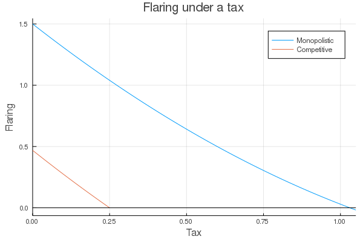
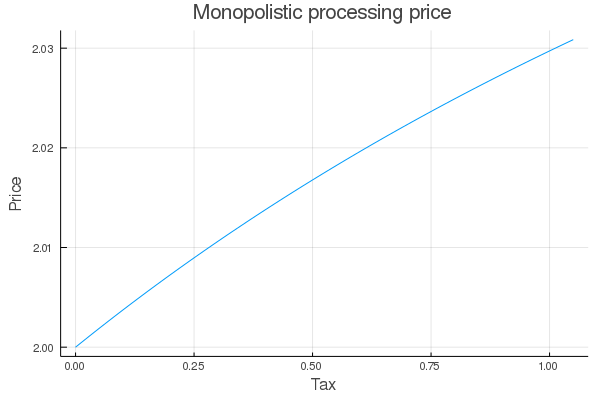

# ToyFlaringModel.jl

See [ToyExample.ipynb](./ToyExample.ipynb)

Install Julia package as below

```julia
]dev https://github.com/magerton/ToyFlaringModel.jl
]instantiate ToyFlaringModel
```

# Example plots




